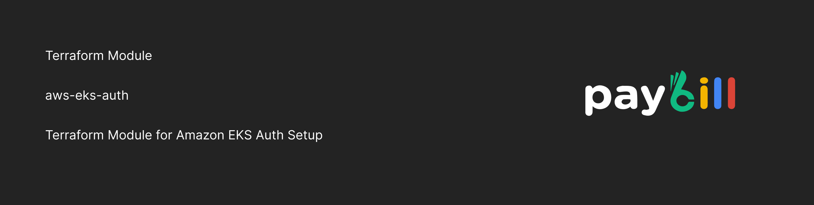

  <a href="https://paybill.dev" target="_blank">
    <picture>
      
    </picture>
  </a>

# Amazon EKS Auth Setup

This Terraform module manages access to an existing Amazon EKS cluster by **safely updating the `aws-auth` ConfigMap**. It allows you to add **extra IAM roles, IAM users, and AWS account IDs** to the cluster without overwriting existing entries.

**What it does**

* Looks up an existing EKS cluster and authenticates to it.
* Reads the current `aws-auth` ConfigMap from the `kube-system` namespace.
* Merges new IAM roles, users, and AWS accounts with what already exists.
* Ensures entries are **deduplicated** and applied idempotently.
* Updates `mapRoles`, `mapUsers`, and `mapAccounts` while preventing accidental deletion.

**Why it’s useful**

* Centralizes EKS access management in Terraform.
* Avoids manual edits to `aws-auth`.
* Makes adding new teams, users, or accounts repeatable and safe.

<!-- BEGIN_TF_DOCS -->
## Requirements

No requirements.

## Providers

| Name | Version |
|------|---------|
|  [aws](#provider\_aws) | n/a |
|  [kubernetes](#provider\_kubernetes) | n/a |

## Modules

No modules.

## Resources

| Name | Type |
|------|------|
| [kubernetes_config_map_v1_data.aws_auth](https://registry.terraform.io/providers/hashicorp/kubernetes/latest/docs/resources/config_map_v1_data) | resource |
| [aws_eks_cluster.eks](https://registry.terraform.io/providers/hashicorp/aws/latest/docs/data-sources/eks_cluster) | data source |
| [aws_eks_cluster_auth.eks](https://registry.terraform.io/providers/hashicorp/aws/latest/docs/data-sources/eks_cluster_auth) | data source |
| [kubernetes_config_map.aws_auth](https://registry.terraform.io/providers/hashicorp/kubernetes/latest/docs/data-sources/config_map) | data source |

## Inputs

| Name | Description | Type | Default | Required |
|------|-------------|------|---------|:--------:|
|  [add\_extra\_aws\_accounts](#input\_add\_extra\_aws\_accounts) | n/a | `list(string)` | `[]` | no |
|  [add\_extra\_iam\_roles](#input\_add\_extra\_iam\_roles) | n/a | <pre>list(object({     groups    = list(string)     role_arn  = string     user_name = string   }))</pre> | `[]` | no |
|  [add\_extra\_iam\_users](#input\_add\_extra\_iam\_users) | n/a | <pre>list(object({     groups    = list(string)     user_arn  = string     user_name = string   }))</pre> | `[]` | no |
|  [eks\_cluster\_name](#input\_eks\_cluster\_name) | The name of the EKS cluster | `string` | `""` | no |

## Outputs

| Name | Description |
|------|-------------|
|  [eks\_cluster\_name](#output\_eks\_cluster\_name) | n/a |
<!-- END_TF_DOCS -->